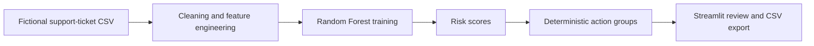

# Customer Support Intelligence Platform

Support-operations decision-support prototype for SLA monitoring, ticket-level breach-risk scoring, and prioritized follow-up.

Live demo: https://customer-support-intelligence-platform.streamlit.app/


## What It Implements

- Streamlit KPI dashboard and ticket explorer
- Data-cleaning and feature-engineering pipeline that excludes target-defining resolution time from model inputs
- Random Forest SLA-breach classifier
- Ticket-level risk scores and deterministic recommended-action groups
- Model-performance and feature-importance views
- CSV export for filtered records and prediction results
- Tests and GitHub Actions validation

## Evidence Boundary

The repository uses fictional demonstration data. Its metrics show that the pipeline executes correctly on that controlled dataset; they are not evidence of production performance.

Recommended actions are deterministic labels derived from model risk scores. The project does not currently connect to a live CRM, automatically update tickets, or execute an autonomous agent.

## Architecture



## Run Locally

```bash
python -m venv .venv
python -m pip install -r requirements.txt
python src/data_cleaning.py
python src/model.py
streamlit run app/streamlit_app.py
```

## Verify

```bash
python -m pip install pytest
pytest -q
python -m compileall app src tests
```

## Limitations

- Fictional, simplified dataset
- No live CRM or ticketing-system integration
- No authentication or role-based access
- No automated alerts or ticket updates

The separate [AI Ops Workflow Automation Platform](https://github.com/RidhanPar/ai-ops-workflow-automation-platform) demonstrates agent orchestration, tools, tracing, evaluation, and approval controls.
