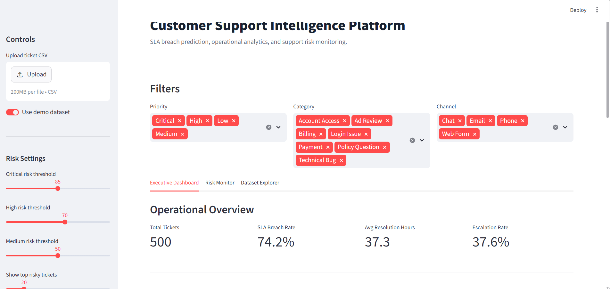
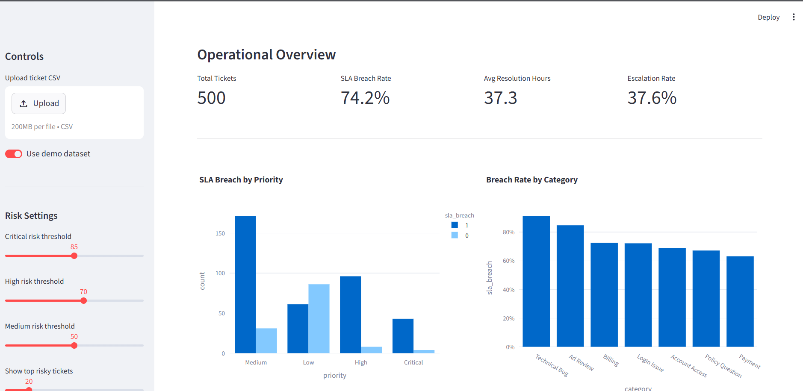
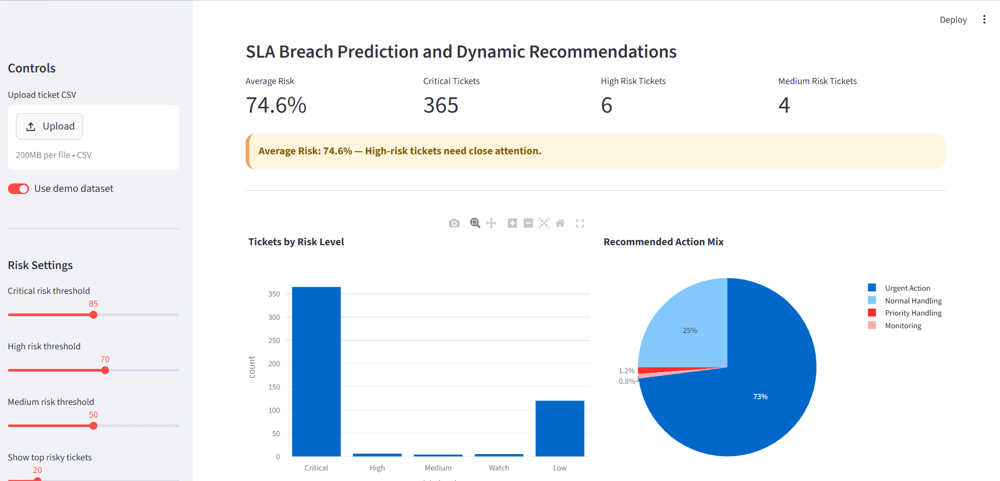
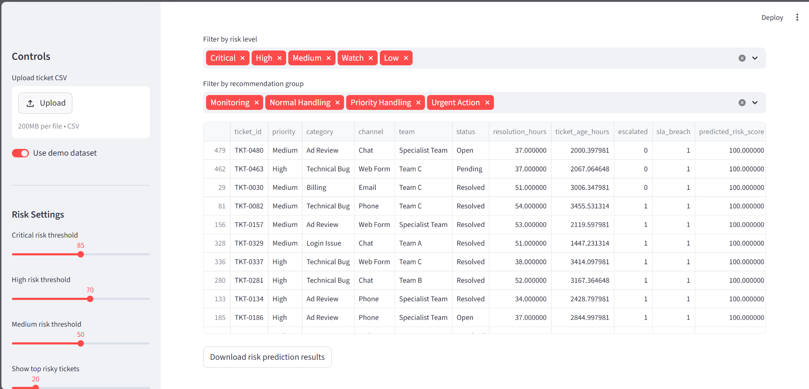
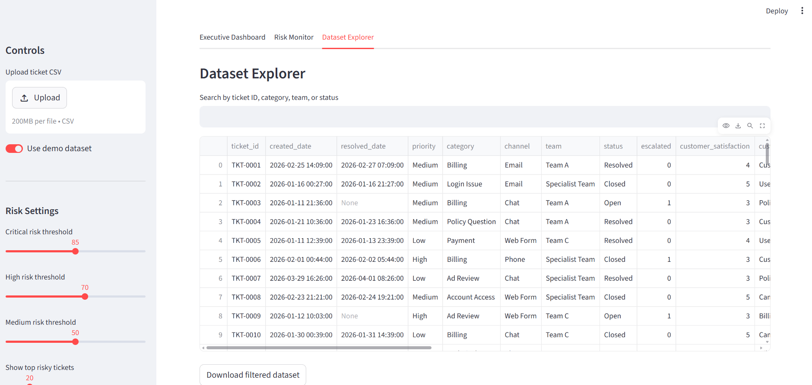

# Customer Support Intelligence Platform

A support operations intelligence platform built to monitor SLA performance, identify service risk, and predict potential SLA breaches using machine learning.

This project combines operational analytics, risk scoring, and interactive dashboarding to help support teams prioritize high-risk tickets, monitor service trends, and make faster data-driven decisions.

## Live Demo

Add your Streamlit live app link here after deployment.

```text
Live Demo: https://customer-support-intelligence-platform.streamlit.app/
```

## Business Problem

Support teams often manage high volumes of tickets across different priorities, channels, categories, and teams. Without a clear way to monitor SLA risk, teams may miss early warning signs that lead to delayed resolutions, escalations, and lower customer satisfaction.

This project simulates how a support operations or service management team can use data to:

* monitor SLA performance
* identify high-risk tickets
* detect operational bottlenecks
* prioritize urgent work
* improve visibility for team leads and managers
* support better service quality decisions

## Solution

The Customer Support Intelligence Platform provides an interactive Streamlit dashboard that allows users to upload support ticket data or use a demo dataset.

The platform helps users monitor operational KPIs, analyze SLA breach patterns, predict ticket-level breach risk, classify tickets by risk level, and generate dynamic action recommendations.

## Key Features

* Executive dashboard for support operations monitoring
* SLA breach prediction using machine learning
* Dynamic risk thresholds for critical, high, and medium risk
* Ticket-level risk scoring
* Recommended action groups based on predicted risk
* Interactive filters for priority, category, channel, and risk level
* Dataset explorer for detailed ticket-level inspection
* CSV export for filtered datasets and prediction results
* Demo dataset support for public portfolio presentation

## Dashboard Sections

### 1. Executive Dashboard

The executive dashboard provides a high-level view of support operations performance.

It includes:

* total tickets
* SLA breach rate
* average resolution hours
* escalation rate
* SLA breach by priority
* breach rate by category

This view is designed for quick operational monitoring and leadership-level visibility.

### 2. Risk Monitor

The risk monitor focuses on SLA breach prediction and action prioritization.

It includes:

* average predicted risk
* critical, high, and medium risk ticket counts
* risk level distribution
* recommended action mix
* ticket-level prediction results
* risk-based filtering
* downloadable prediction output

This section helps support teams identify which tickets require urgent review, priority handling, monitoring, or normal handling.

### 3. Dataset Explorer

The dataset explorer allows users to inspect the underlying ticket data.

It includes:

* search by ticket ID, category, team, or status
* filtered table view
* raw ticket-level fields
* downloadable filtered dataset

This section supports deeper investigation and data validation.

## Machine Learning Approach

The project uses a Random Forest model to predict the probability of an SLA breach based on operational ticket features.

### Example Input Features

* ticket priority
* ticket category
* support channel
* assigned team
* ticket age
* escalation status
* resolution hours
* customer satisfaction score

### Output

The model output is converted into:

* predicted SLA breach risk score
* risk level classification
* recommended action group

### Risk Levels

Example risk levels include:

* Critical
* High
* Medium
* Watch
* Low

### Recommendation Groups

Example recommendation groups include:

* Urgent Action
* Priority Handling
* Monitoring
* Normal Handling

## Screenshots

### Dashboard Overview



### Operational KPIs



### Risk Monitor



### Recommendation Table



### Dataset Explorer



## Project Structure

```text
customer-support-intelligence-platform/
├── app/
│   └── streamlit_app.py
├── assets/
│   └── screenshots/
├── data/
├── models/
├── notebooks/
├── src/
├── README.md
└── requirements.txt
```

## Tech Stack

* Python
* Streamlit
* Pandas
* NumPy
* Plotly
* Scikit-learn
* Joblib

## How to Run Locally

### 1. Clone the Repository

```bash
git clone https://github.com/RidhanPar/customer-support-intelligence-platform.git
cd customer-support-intelligence-platform
```

### 2. Create a Virtual Environment

```bash
python -m venv venv
```

### 3. Activate the Virtual Environment

For Windows:

```bash
venv\Scripts\activate
```

For macOS or Linux:

```bash
source venv/bin/activate
```

### 4. Install Dependencies

```bash
pip install -r requirements.txt
```

### 5. Run the App

```bash
streamlit run app/streamlit_app.py
```

## Demo Data

The project includes a demo dataset for portfolio and testing purposes.

Users can either:

* use the built-in demo dataset
* upload their own CSV file with compatible ticket fields

The demo data is fictional and created for public project demonstration.

## Example Use Case

A support operations manager wants to understand which tickets are most likely to breach SLA.

Using this dashboard, the manager can:

1. Load ticket data.
2. Review overall SLA breach rate.
3. Identify high-risk categories or priorities.
4. Open the risk monitor.
5. Review tickets classified as critical or high risk.
6. Export the prediction results.
7. Prioritize follow-up actions for the support team.

## Business Value

This project demonstrates how support operations teams can use analytics and machine learning to improve service visibility and ticket prioritization.

The platform supports:

* faster identification of SLA risk
* better prioritization of high-risk tickets
* improved operational reporting
* clearer visibility for team leads and managers
* more structured support decision-making

## Future Improvements

Planned improvements include:

* add model performance metrics directly inside the dashboard
* add SLA trend forecasting over time
* add team-level performance comparison
* add aging ticket alerts
* add automated weekly report export
* connect the dashboard to a live database
* add role-based access for managers and analysts
* add integration with workflow automation tools

## Portfolio Summary

Customer Support Intelligence Platform is a support operations analytics project that combines SLA monitoring, machine learning risk prediction, interactive dashboards, and action recommendations.

It demonstrates practical skills in data analytics, operational reporting, machine learning, support analytics, dashboard development, and data-driven decision-making.
