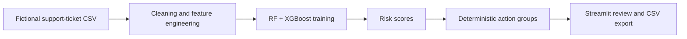
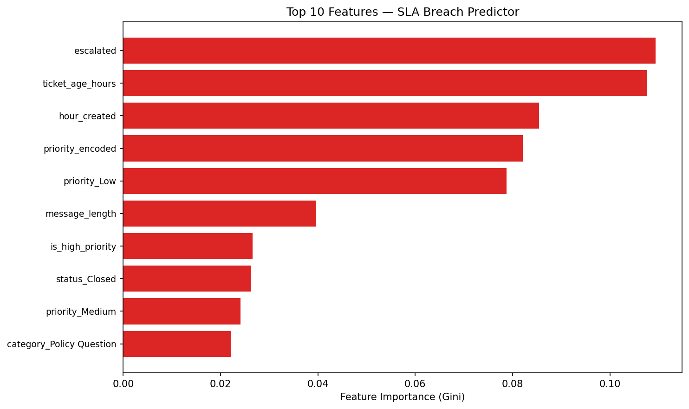

# Customer Support Intelligence Platform

Workforce and service quality analytics platform designed to give People teams real-time visibility into support team performance. Tracks agent KPIs, workload distribution, response time trends, and resolution rates to support capacity planning and people decisions. Built with Python, Streamlit, and Plotly.

Live demo: https://customer-support-intelligence-platform.streamlit.app/


## What It Implements

- Streamlit KPI dashboard and ticket explorer
- Data-cleaning and feature-engineering pipeline that excludes target-defining resolution time from model inputs
- Random Forest and XGBoost SLA-breach classifiers with model comparison
- Ticket-level risk scores and deterministic recommended-action groups
- Model-performance and feature-importance views
- SQL layer with CTEs and window functions (`sql/`)
- Docker support for containerised deployment
- CSV export for filtered records and prediction results
- Tests and GitHub Actions validation

## People Team Use Cases

- Identify underperforming team members early for targeted coaching
- Track workload distribution to support fair scheduling and capacity planning
- Monitor team-level resolution trends to flag burnout risk before attrition occurs
- Replace manual weekly HR review meetings with same-day dashboard visibility

## Evidence Boundary

The repository uses fictional demonstration data. Its metrics show that the pipeline executes correctly on that controlled dataset; they are not evidence of production performance.

Recommended actions are deterministic labels derived from model risk scores. The project does not currently connect to a live CRM, automatically update tickets, or execute an autonomous agent.

## Architecture



## Model Performance

Two classifiers trained on the same 80/20 stratified split (400 train / 100 test). Class imbalance (74% breach rate) handled via `class_weight="balanced"` (RF) and `scale_pos_weight` (XGBoost). `resolution_hours` is excluded from features to prevent target leakage.

| Model | ROC-AUC | Precision | Recall | F1 | Accuracy |
|---|---|---|---|---|---|
| Random Forest | 0.90 | 0.87 | 0.97 | 0.92 | 0.87 |
| XGBoost | 0.87 | 0.90 | 0.93 | 0.91 | 0.87 |

**Confusion matrix — Random Forest (threshold 0.5):** TP=72, FP=11, TN=15, FN=2

**Confusion matrix — XGBoost (threshold 0.5):** TP=69, FP=8, TN=18, FN=5

At the default threshold of 0.5, Random Forest catches 97% of SLA breaches (Recall=0.97) while generating 11 false positives. For a triage use case where missing a breach is more costly than over-flagging, the high recall is preferable. XGBoost achieves slightly better precision (0.90 vs 0.87) and fewer false positives (8 vs 11), making it the better choice if alert fatigue is a concern. Random Forest is preferable when interpretability matters — operations managers can inspect decision paths — while XGBoost better suits precision-sensitive environments.

### Feature Importance (Random Forest)



| Rank | Feature | Importance (Gini) |
|---|---|---|
| 1 | escalated | 10.9% |
| 2 | ticket_age_hours | 10.8% |
| 3 | hour_created | 8.5% |
| 4 | priority_encoded | 8.2% |
| 5 | priority_Low | 7.9% |

**`escalated` (10.9%)** is the top predictor — escalated tickets involve additional coordination steps that extend resolution time, pushing them past SLA targets. **`ticket_age_hours` (10.8%)** captures how long a ticket has been open regardless of current resolution status, acting as a real-time SLA clock. **`priority_encoded` (8.2%)** encodes the SLA threshold directly: Critical tickets carry a 6-hour window versus 48 hours for Low priority, making the same delay catastrophic for one tier and acceptable for another.

## Key Findings

- **Significant class imbalance (74% breach rate):** Without explicit class balancing, both models would default to predicting breach for most tickets and report misleadingly high accuracy. The `class_weight="balanced"` / `scale_pos_weight` adjustments are what give the models meaningful precision at the lower-risk end.
- **Escalation and ticket age are the strongest independent signals:** With `resolution_hours` excluded to prevent leakage, the model relies on early-observable features. Escalated tickets and older open tickets are the two most predictive signals the system has before resolution completes.
- **Priority creates structurally different risk profiles:** A ticket resolved in 10 hours is compliant for Medium (24 hr SLA) but a breach for High (12 hr) and Critical (6 hr). The model learns this threshold implicitly through `priority_encoded`, making priority filtering an effective first-pass triage step for operations teams.

## SQL Layer

The `sql/` folder demonstrates production-ready SQL feature engineering:

- **`sql/schema.sql`** — `CREATE TABLE IF NOT EXISTS support_tickets` DDL with typed columns and indexes
- **`sql/feature_extraction.sql`** — CTE + two window functions (`AVG() OVER ROWS BETWEEN`, `ROW_NUMBER() OVER`) + computed breach label and SLA consumption percentage
- **`src/db_loader.py`** — `load_to_sqlite(df, db_path)` and `extract_features_sql(db_path)` functions

```python
from src.data_cleaning import clean_data
from src.db_loader import load_to_sqlite, extract_features_sql

df = clean_data("data/raw/support_tickets.csv")
load_to_sqlite(df, "support_tickets.db")
features = extract_features_sql("support_tickets.db")
```

## Project Structure

```text
customer-support-intelligence-platform/
├── app/
│   └── streamlit_app.py
├── assets/
│   └── screenshots/
├── data/
│   ├── raw/
│   └── processed/
├── models/
├── sql/
│   ├── schema.sql
│   ├── feature_extraction.sql
│   └── README.md
├── src/
│   ├── data_cleaning.py
│   ├── db_loader.py
│   ├── feature_engineering.py
│   └── model.py
├── tests/
├── Dockerfile
├── .dockerignore
├── requirements.txt
└── README.md
```

## Run Locally

```bash
python -m venv .venv
python -m pip install -r requirements.txt
python src/data_cleaning.py
python src/model.py
streamlit run app/streamlit_app.py
```

## Run with Docker

```bash
docker build -t sla-predictor .
docker run -p 8501:8501 sla-predictor
```

Then open http://localhost:8501. Use the **Train / Refresh Model** button in the sidebar — model files are excluded from the image and must be trained on first launch.

## Verify

```bash
python -m pip install pytest
pytest -q
python -m compileall app src tests
```

## Tech Stack

| Layer | Technology |
|---|---|
| Frontend | Streamlit |
| Charts | Plotly, Matplotlib |
| Data | Pandas, NumPy |
| ML Models | Scikit-learn (Random Forest), XGBoost |
| SQL | SQLite via built-in `sqlite3` |
| Persistence | Joblib |
| Containerisation | Docker |

**Keywords:** people-analytics · workforce-intelligence · hr-analytics · streamlit · sla-breach-prediction · support-operations · machine-learning

## Limitations

- Fictional, simplified dataset
- No live CRM or ticketing-system integration
- No authentication or role-based access
- No automated alerts or ticket updates

The separate [AI Ops Workflow Automation Platform](https://github.com/RidhanPar/ai-ops-workflow-automation-platform) demonstrates agent orchestration, tools, tracing, evaluation, and approval controls.
